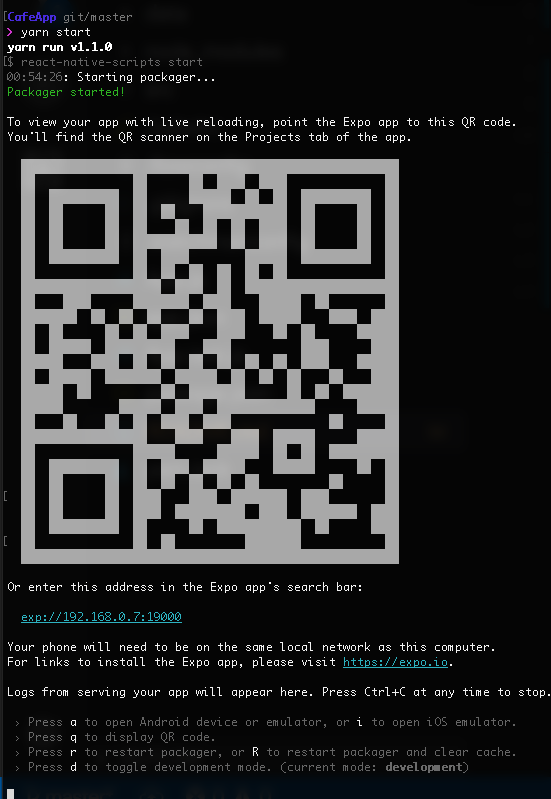

# 프로젝트 실행하는 법

- node.js 설치
- create-react-native-app 설치
   ```sh
   npm install -g create-react-native-app
   ```
- project clone 받은 후 `npm install` 실행
- `npm run start` 실행

- `i`를 눌러 iPhone Simulator를 통해 실행하거나 안드로이드 에뮬레이터 실행 뒤 `a`를 누르면 안드로이드 에뮬레이터로 실행됨
  - 실기기에서 실행하려면 디바이스에서 `expo` 설치
    - android - https://play.google.com/store/apps/details?id=host.exp.exponent
    - ios - https://itunes.apple.com/us/app/expo-client/id982107779?mt=8
    - 설치 후 QR코드 스캔으로 console에 떠있는 QR코드 스캔 

# 구글 인증 연동하기
- https://docs.expo.io/versions/latest/sdk/google.html 를 참고하여 구글 프로젝트 생성 뒤 `android client id`와 `ios client id`를 생성
- 프로젝트 루트에 .env를 만들고 아래와 같은 파일을 생성
  ```
  ANDROID_CLIENT_ID=YOUR_ANDROID_CLIENT_ID
  IOS_CLIENT_ID=YOUR_IOS_CLIENT_ID
  ``` 

# 실기기에서 데모 체험하기
- 실기에서 `expo` 설치한 뒤 https://expo.io/@rotoshine/smartstudy-cafe 에 있는 QR 코드 스캔